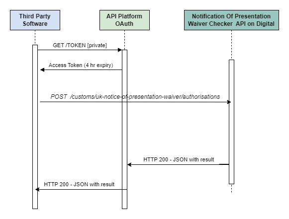

Version 1.0 issued 24 June 2024

# Notification of Presentation (NOP) Waiver Checker Service Guide

This guide explains how Community System Providers (CSPs) can use the NOP Waiver Checker API. It details the process of passing Economic Operators Registration and Identification (EORI) numbers to check NOP Waiver validity. 

It is also intended to help software developers and others involved in integrating software that connects to NOP Waiver Checker API.

**Note:** The NOP Waiver Checker API is restricted to CSPs and not available to other users.

## Overview

This API allows CSPs to check if traders have a valid NOP Waiver authorisation using their EORI number. This waiver is required for the transit of Not At Risk (NAR) goods moving through from GB-NI. 

The API follows REST principles and has a single POST method endpoint that returns the data in JSON format. It uses standard HTTP error response codes. Use this API to request the NOP Waiver authorisation status of between 1 and 3000 EORI numbers passed as an array. 

**Note:** The API endpoint relates only to Great Britain and Northern Ireland.

### What is an EORI number?

EORI stands for Economic Operators Registration and Identification. It is a unique identification number used by customs authorities across the European Union (EU) to track imports and exports. Any business or individual shipping goods internationally will have an EORI number. This API uses this number to check the authorisation of NOP Waivers. This system replaced the older Trader's Unique Reference Number (TURN) system. For those in the UK, HM Revenue and Customs (HMRC) issues these numbers.

A typical EORI number for UK VAT-registered businesses is as follows:
```text
GB205672212000
```

Below is a breakdown of this EORI number format:

- GB: Indicates that the business is UK-based.
- 205672212: Represents the business's VAT Registration Number.
- 000: These three zeros are always added to the end of a UK EORI number.
- Total number of characters permitted for the EORI (including the prefix GB or XI) is between 12 and 15.

In summary, having an EORI number is essential for anyone involved in international trade, as it allows customs authorities to monitor and track shipments effectively.

## API Workflow



This sequence diagram outlines the process for checking authorisations using the NOP Waiver Checker API. Below is an explanation of each step involved in the workflow:

1. **Request access token:** The third-party software asks the API platform for an access token by sending a GET request. This step is secure and private.

2. **Receive access token:** The API platform provides an access token, which is valid for 4 hours. This token will be used to verify future requests.

3. **Submit authorisation request:** Using the access token, the third-party software sends a POST request to the `/customs/uk-notice-of-presentation-waiver/authorisations` endpoint.

4. **Receive authorisation result:** The NOP Waiver Checker API processes the request and replies with an HTTP 200 status code and a JSON response containing the authorisation result.

## API Status

This version of the NOP Waiver Checker API:

- is in [the alpha phase](https://www.gov.uk/service-manual/agile-delivery/how-the-alpha-phase-works)
- supports **only** the NOP Waiver Checker API v1.0
- is currently **not** ready for testing
- will **not** be ready for use in production until the service goes live

Use this API to:

- Request the NOP Waiver authorisation status of 1-3000 EORIs passed as an array.
- Run tests in the HMRC sandbox environment.

## Developer Setup

In the context of this API, the term "developer" refers to software developers who either work directly for CSPs or are contracted to CSPs through third parties.

### Getting started

Developers must follow the steps below before you can use your software in the test and live environment and access this API:

1. **[Register for a developer account](https://developer.service.hmrc.gov.uk/developer/registration)** on the HMRC Developer Hub. 
2. To **create** a standard application, follow the instructions on [Using the Developer Hub](https://developer.service.hmrc.gov.uk/api-documentation/docs/using-the-hub)
3. As the API is private, please contact [SDSTeam@hmrc.gov.uk](mailto:SDSTeam@hmrc.gov.uk) with your sandbox application ID and name. The Software Developer Support (SDS) Team will then **subscribe** your sandbox application to the NOP Waiver Checker API.
4. **Learn** about the [application-restricted endpoints](https://developer.service.hmrc.gov.uk/api-documentation/docs/authorisation/application-restricted-endpoints) featured in this API. It uses the open standard [OAuth2.0](https://oauth.net/2/) with the [Client Credentials Grant](https://oauth.net/2/grant-types/client-credentials/) to generate an access token.

To develop using the NOP Waiver Checker API, you must:

- be familiar with HTTP, RESTful services, JSON and OAuth2
- be registered as a developer on the HMRC Developer Hub

Each application you register will be assigned an HMRC 'ApplicationId'.

You can access all the applications you have registered on [Developer Hub Applications](/developer/applications). There, you can administer things like API subscriptions and [application credentials](/api-documentation/docs/authorisation/credentials).

### Making API requests

Before sending any requests to the NOP Waiver Checker API, make sure that you are addressing the following points in your software:

- the correct URL for the environment and API version number
- the correct header contents and payload information

For details, see the [NOP Waiver Checker API v1.0 Reference Guide](/api-documentation/docs/api/service/uknw-auth-checker-api/1.0). 

**Note:** The NOP Waiver API is restricted to CSPs and the above link will not be accessible to other users.

The base URLs of the sandbox and production environments are as follows:
```code
Sandbox	https://test-api.service.hmrc.gov.uk/customs/uk-notice-of-presentation-waiver/

Production https://api.service.hmrc.gov.uk/customs/uk-notice-of-presentation-waiver/
```

## End-to-end User Journeys

- [Developer journey overview](/guides/uknw-auth-checker-api-service-guide/#developer-journey-overview)
- [CSP journey overview](/guides/uknw-auth-checker-api-service-guide/#csp-journey-overview)

### Developer journey overview

Follow this end-to-end journey to setup your developer environment, request NOP Waiver authorisation using EORIs, and move your application to production.

1. **Complete** [Developer setup](/guides/uknw-auth-checker-api-service-guide/#developer-setup) instructions.
2. **Read** [Making API requests](/guides/uknw-auth-checker-api-service-guide/#making-api-requests) guidance.
3. **Request access token:** [Send a POST request to generate an access token](/api-documentation/docs/authorisation/application-restricted-endpoints#getting-access-token) from the API platform.<br> Example of a POST request to generate an access token:
	```code
	curl -X POST -H "content-type: application/x-www-form-urlencoded" --data \
	"client_secret=[YOUR-CLIENT-SECRET] \
	&client_id=[YOUR-CLIENT-ID] \
	&grant_type=client_credentials \
	https://test-api.service.hmrc.gov.uk/oauth/token
	```
4. **Receive access token:** [The response](/api-documentation/docs/authorisation/application-restricted-endpoints#getting-access-token) contains the access token used to call the API. Store the access token received.
5. **Test** your application in the sandbox environment by following the steps on [Testing in the Sandbox](https://developer.service.hmrc.gov.uk/api-documentation/docs/testing).<br> **Note:** This API does not feature user-restricted endpoints, please disregard any information on this.
6. **Submit authorisation request:** Send a POST request to the `/customs/uk-notice-of-presentation-waiver/authorisations` endpoint. Include an array of EORI numbers between 1 and 3000.<br>
Example of a POST request for a single EORI number:
	```code
	{
		"eoris": [
			"GB123123123333"
		]
	}
	```
7. **Receive authorisation result:** Check the response from the API for the authorisation result.<br>
Example of a successful response:
	```code
	{
		"date": "2024-02-01T14:15:22Z",
		"eoris": [
			{
				"eori": "GB123123123123",
				"authorised": true
			}
		]
	}
	```
8. **Complete** a form when you require live production credentials. You can find this under the [Applications tab](/developer/applications) in the Manage Applications section of the Developer Hub by clicking the 'Add an application to Production' link. 
9. **Implement API** link directly into a user interface for CSPs.

### CSP journey overview

1. **Integrate the API:** Developers should follow the [Developer journey overview](/guides/uknw-auth-checker-api-service-guide/#developer-journey-overview) to integrate the NOP Waiver Checker API into your software with a corresponding user interface (UI). 
2. **Trader completes C21 form:** To send goods between GB and NI, a trader must complete and submit a [C21 form](https://www.gov.uk/government/publications/import-and-export-customs-clearance-request-c21). 
3. **Check trader credentials:** If the trader does not have [Authorised Economic Operator status](https://www.gov.uk/government/publications/check-if-a-business-holds-authorised-economic-operator-status), their NOP Waiver authorisation status must be checked.  
4. **Access the API:** Use the UI created by your developers to access the API.
5. **Check NOP Waiver status:** Use the API to verify the traders' NOP Wavier authorisation.
6. **Authorise EIDR:** Authorise the trader for Entry in Declarants Records (EIDR) once NOP Waiver status is verified.
7. **Goods are shipped:** The trader can now ship the goods between GB and NI.

## Error Responses

A detailed description of the error responses for this API can be found in the [NOP Waiver Checker API v1.0 reference guide](/api-documentation/docs/api/service/uknw-auth-checker-api/1.0).

**Note:** The NOP Waiver API is restricted to CSPs and the above link will not be accessible to other users.

## API Rate Limiting

Each software house should register a single application with HMRC. This application will be used to identify the software house during the OAuth 2.0 grant flow and will also be used in subsequent per user API calls. We limit the number of requests that each application can make. This protects our backend service against excessive load and encourages real-time API calls over batch processing.

We set limits based on anticipated loads and peaks. Our standard limit is 3 requests per second per application. If you believe that your application will sustain traffic load above this value, contact the SDS Team at email [SDSTeam@hmrc.gov.uk](mailto:SDSTeam@hmrc.gov.uk)

## Changelogs

### API changelog

The [NOP API Changelog](https://github.com/hmrc/uknw-auth-checker-api/blob/main/CHANGELOG.md) (GitHub) provides detailed and comprehensive information about API changes.

### Document changelog

Below is a summary of updates to this service guide.

**6 August 2024**

- Edited [Getting started section](/guides/uknw-auth-checker-api-service-guide/#getting-started) to include step-by-step instructions for developers
- Added [End-to-end User Journeys section]() with detailed [developer](/guides/uknw-auth-checker-api-service-guide/#developer-journey-overview) and [CSP](/guides/uknw-auth-checker-api-service-guide/#csp-journey-overview) journey overviews

**18 July 2024**

- Added [API Workflow section](/guides/uknw-auth-checker-api-service-guide/#api-workflow) with sequence diagram and description

**11 July 2024**

- Updated content for [What is an EORI number section](/guides/uknw-auth-checker-api-service-guide/#what-is-an-eori-number)

**24 June 2024**

- Initial draft created
